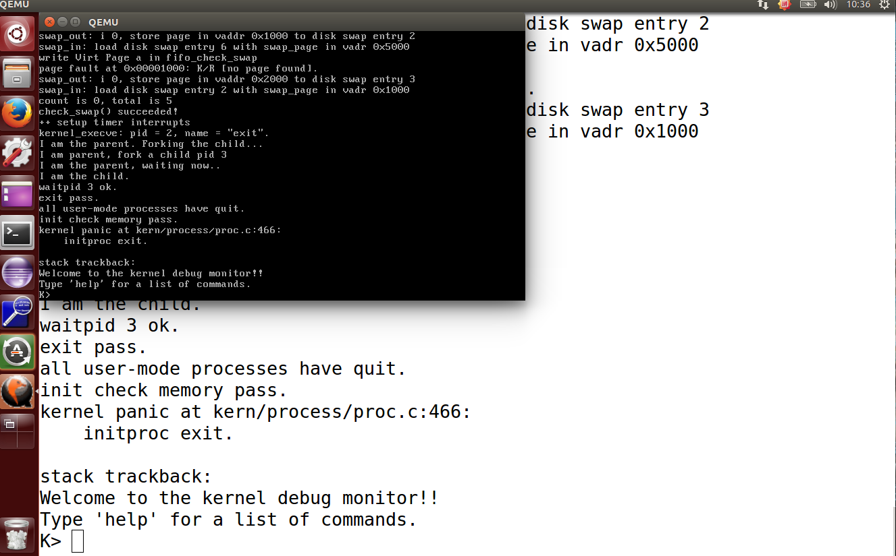

# Lab5 实验报告

##### 2016011364 张岱墀

## 练习1：加载应用程序并执行

答：修改`kern/process/proc.c`文件下的`load_icode()`函数，该函数的主要作用为将指定二进制程序加载进当前进程，该函数的部分已经被实现，需要我们填的其实不多：

```
tf -> tf_cs = USER_CS;
tf -> tf_ds = tf -> tf_es = tf -> tf_ss = USER_DS;
tf -> tf_esp = USTACKTOP;
tf -> tf_eip = elf -> e_entry;
// eflag register
tf -> tf_eflags = FL_IF;            
```

需要我们填的内容大概分为如下步骤：

1. 设置`trapframe`的`tf_cs`成员为`USER_CS`段
2. 设置`trapframe`的`tf_ds`，`tf_es`，`tf_ss`为`USER_DS`段
3. 设置`trapframe`的`tf_esp`为用户栈的栈顶地址
4. 设置`trapframe`的`tf_eip`为指定的二进制文件的入口指针
5. 设置`trapframe`的`eflags`使其能够产生中断

同时，本次实验中涉及到了一些对于先前实验的`update`，在此一一列举出来：

* `kern/trap/trap.c`中的`idt_init()`函数的更新，使用户进程能够调用`syscall`系统调用，增加一行代码：

```
SETGATE(idt[T_SYSCALL], 1, GD_KTEXT, __vectors[T_SYSCALL], DPL_USER);
```

* `kern/trap/trap.c`中的`trap_dispatch()`函数的更新，在先前的时钟计数打印信息中，每进行一次时钟计数，需要把当前进程的`need_resched`设为`1`：

```
// lab5
current -> need_resched = 1;
```

* `kern/process/proc.c`中的`alloc_proc()`函数，进行进程初始化时需要将其他某些指定成员变量初始化：

```
proc -> wait_state = 0;
proc -> cptr = NULL;
proc -> yptr = NULL;
proc -> optr = NULL;
```

* `kern/process/proc.c`中的`do_fork()`函数，需要设置新创建进程的父进程为原先进程，保证当前进程的`wait_state`为`0`，除了`lab4`中把进程插入`proc_list`和`hash_list`中之外，还需要设置进程的`link`：

```
proc -> parent = current;
if(current -> wait_state != 0) {
panic("do fork in lab5: current -> wait_state must be 0.\n");
}
hash_proc(proc);
set_links(proc); 
```


回答问题：

首先在`ucore`中，最先是将我们的用户进程程序和`kern`一并放在了内存中，所以并不涉及`file system`，之后只是通过`do_exerve()`函数找到相应用户进程并进行必要设置之后开始执行

而`do_exerve()`函数主要实现了如下几个功能：

1. 清空原先进程的内容，包括调用`exit_mmap()`，`put_pgdir()`，`mm_destory()`函数
2. 加载目标用户程序到指定进程(外壳)，通过调用`load_icode()`函数实现
3. 在`load_icode()`函数中，为了能执行用户进程，首先建立了新的内存空间，包括建立新页表等，之后通过分析`ELF`文件格式的`header`从而找到用户进程的代码段数据段等，最后建立了新的用户栈以使用户进程能够执行正确的函数调用等

之后，用户程序就可以开始在用户态执行


## 练习2：父进程复制自己的内存空间给子进程

答：修改`kern/mm/pmm.c`中的`copy_range()`函数，该函数的主要功能为完成父进程到子进程的资源拷贝，其中部分功能已经被实现，需要我们实现的部分如下：

```
void * kva_src = page2kva(page);
void * kva_dst = page2kva(npage);

memcpy(kva_dst, kva_src, PGSIZE);

ret = page_insert(to, npage, start, perm);
assert(ret == 0);
}
```

该部分主要是完成父进程到子进程`page`的拷贝，实现步骤如下：

1. 通过`page2kva()`函数得到父进程`page`对应的内核虚拟地址
2. 同上得到子进程`npage`对应的内核虚拟地址
3. 通过`memcpy()`函数将父进程的`page`内容拷贝到子进程相应`page`
4. 调用`page_insert()`，建立新的页的物理地址和线性地址的映射关系


回答问题：

`COW`概要设计：

1. 原本的进程复制函数`do_fork()`进行相应更改：只是返回一个新的指向父进程的指针，并不进行实际的复制
2. 实现新的复制函数，使其功能为原先`do_fork()`的功能，即进行实际复制
3. 将父进程页表项的标志位进行更改，使其为只读，此时，当发生写操作时会触发`page fault`
4. 当触发`page fault`后，调用新实现的函数进行实际的复制，即实现了`copy on write`


## 练习3：阅读代码，理解进程执行`fork/exec/wait/exit`的实现，以及系统调用的实现

答：在`kern/process/proc.c`文件下可以找到这些函数的具体实现：

* `fork`函数分析：

  `fork`具体由`kern/process/proc.c`中的`do_fork()`函数实现，该函数完成了由父进程创建新子进程的功能，其具体填充也在之前的`lab4`中完成，在`lab5`中给出了一些补充。其主要按如下步骤实现：

  1. 通过`alloc_proc()`分配一个新的`process_control_block`的结构体用于子进程
  2. 设置新进程和父进程的关系以及通过`get_pid()`给新的子进程分配独有的`pid`
  3. 通过复制的方式设置子进程的内核栈和内存管理单元
  4. 通过复制的方式设置子进程的上下文
  5. 将新进程插入进程列表和`hash表`中
  6. 通过`wake_up`唤醒该进程

* `exec`函数分析：

  `exec`具体由`kern/process/proc.c`中的`do_execve()`函数实现，该函数完成了进程的加载。其主要通过以下步骤实现：

  1. 调用`exit_mmap()`和`put_pgdir()`为当前进程设置对应内存空间
  2. 调用`load_icode()`加载指定的二进制程序到当前进程

* `wait`函数分析：

  `wait`具体由`kern/process/proc.c`中的`do_wait()`函数实现，该函数完成了父进程的`wait`操作，等待子进程结束后释放其所占资源。其主要通过以下步骤实现：

  1. `repeat`判定子进程，特别当其为僵尸进程时进行特判
  2. 通过一系列`free`接口，在子进程结束后释放其资源

* `exit`函数分析：

  `exit`具体由`kern/process/proc.c`中的`do_exit()`函数实现，该函数实现了进程退出时的资源释放、进程状态设置以及重新调度进程。其主要通过以下步骤实现：

  1. 调用`exit_mmap()`，` put_pgdir()`，`mm_destroy()`函数释放掉进程所占的几乎所有内存空间
  2. 设置进程的`state`，然后唤醒其父进程
  3. 指示调度器切换到其他进程


回答问题：

* 通过设置`Process Control Block`结构体的成员变量`state`来影响进程的执行状态
* 执行生命周期：
  * 进程创建  -> 进程就绪：`fork`
  * 进程就绪 -> 进程运行：被调度
  * 进程运行 -> 进程就绪：时间片用完
  * 进程运行中：调用`exec`
  * 进程运行 -> 进程等待：`wait`
  * 进程等待 -> 进程就绪：子进程的`exit`
  * 进程运行 -> 进程退出：`exit`

## 实验完成后相关截图




## 与ucore_lab中的参考答案进行对比

#### 练习一：加载应用程序并执行

> 所实现功能的本质基本一样，update之前实验部分与答案的部分实现顺序不同，但经测试对结果无影响

#### 练习二：父进程复制自己的内存空间给子进程

>所实现功能的本质基本一样

#### 练习三：阅读代码，理解进程执行`fork/exec/wait/exit`的实现，以及系统调用的实现

> 并未给出与该练习相关的答案


## 列出本实验个人觉得重要的知识点以及与课程对应内容的对应

* 实验一涉及的`load_icode()`对应于课程内容中的`进程加载`部分，将用户态进程加载进内存并执行，个人觉得是用户态进程相关的很重要的知识点
* 实验二和实验三中涉及的`fork()`，`wait()`，`exit()`对应于课程内容中的`新进程创建`，`进程等待`，`进程退出`三个部分内容，个人觉得这三个部分在用户态进程管理中也是很重要的知识点


## 列出觉得OS原理中很重要的但是该实验中未被涉及的知识点

- 课程内容中还涉及到了用户态进程的切换部分，虽然在之前的lab4涉及到了进程切换，但那也只是在内核态的进程切换，转到用户态，对于该切换部分本次实验并未涉及太多