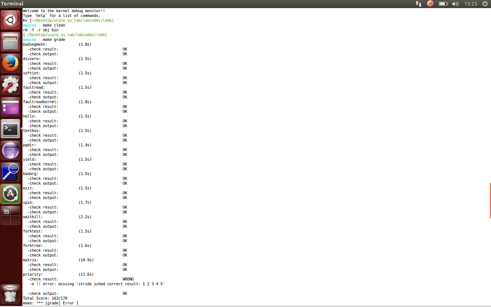
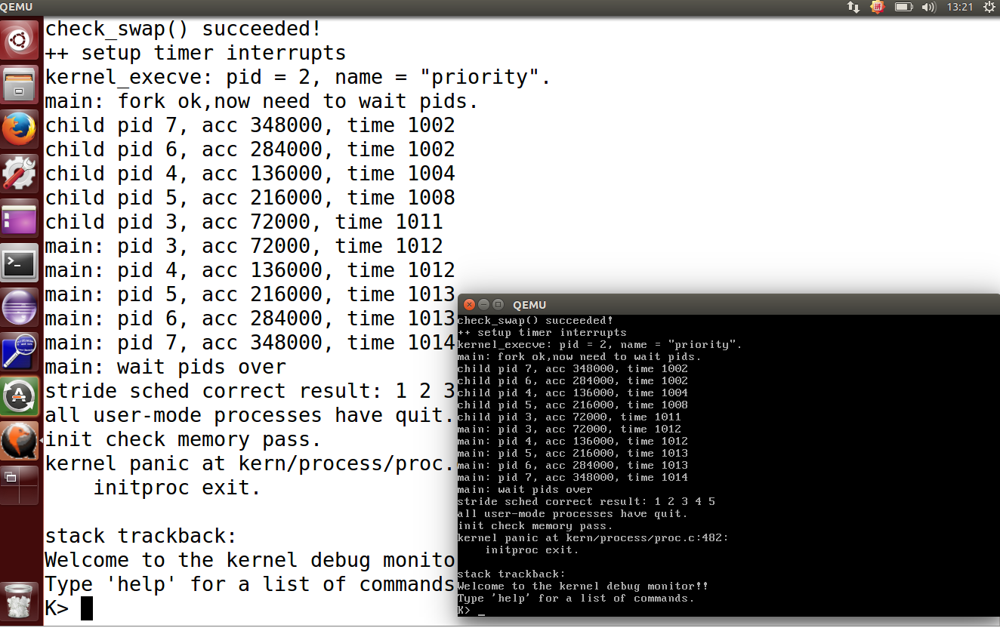

# Lab6 实验报告

2016011364 张岱墀

## 练习1：使用Round Robin调度算法

答：执行`make grade`后的运行截图：

在直接移植后的`lab6`中还有部分地方标记有`lab6 update`的地方进行了修改，运行`make grade`后，大部分的测试通过，但`priority.c`并没有通过。

回答问题：

* 请理解并分析`sched_class`中各个指针的用法，并结合RR算法描述ucore的调度执行过程：
  * char* name：该调度算法的名称
  * struct run_queue *rq：被调度的进程的队列
  * struct proc_struct *proc：被操作的进程，如删除、插入进程队列过程
  * *(init) *(enqueue) *(dequeue) *(proc_tick)：相当于父类声明的函数的指针，由子类具体实现。比如原代码中，`default_sched.c`中实现了以上四个函数
* 请在实验报告中简要说明如何设计实现`多级反馈队列调度算法`，给出概要设计，鼓励详细设计：
  * 重新定义一个新`struct`，比如命名为`MLFQ`，该结构用于实例化一个`多级反馈队列调度算法`，其中包含成员变量：`sched_class`的指针，和调度不同队列进程的函数`proc_sched_MLFQ()`，该函数用于在不同优先级队列间进行进程的调度
  * 该结构的每一个`sched_class`都代表某个优先级的队列，可以用数组索引作为优先级，也可以在结构体内另开数组存下优先级，该队列有自己的调度算法，与整个`MLFQ`无关
  * 函数`proc_shed_MLFQ()`负责不同优先级队列间的调度，该调度涉及到两个队列，某个特定进程，通过调用`sched_class`的插入和删除函数来具体实现

## 练习2：实现Stride Scheduling调度算法

答：算法设计主要是替换并修改了`kern/schedule/default_schedule.c`文件，算法框架和原先的`RR`算法类似，算法主要包括如下函数：

* `stride_init()`：初始化调度器类的信息，在该实验的算法中，主要包括：

  * 初始化运行队列(`rq`)
  * 初始化进程池(`lab6_run_pool`)
  * 初始化进程数(`proc_num`)

* `stride_enqueue()`：将指定进程`proc`插入运行队列中，实验中提供了两种具体的实现方式，一种是通过`heap`，另一种是通过`list`，个人选择的是后者，步骤包括：

  * 调用`list`相关接口将该进程插入运行队列
  * 设置该进程的时间片(`time_slice`)
  * 将该进程的运行队列设置为插入后的运行队列
  * 更新总进程数

* `stride_dequeue()`：从运行队列中删除指定进程，同上选择通过`list`来实现，步骤包括：

  * 调用`list`相关接口删除指定进程对应的节点
  * 更新总进程数

* `stride_pick_next()`：选择下一个运行的进程，按照`Stride Scheduling`算法的思想：遍历整个运行队列，返回其中`stride`值最小者对应的进程作为选择的结果，之后更新进程的`stride`值，更新方式为：

  `stride += BIGSTRIDE / ((priority == 0) ? 1 : priority)`

* `stride_proc_tick()`：检测当前进程是否已经使用完时间片，若未用完，则时间片计数减一；若用完，则将进程`need_sched`成员置为1，表示该进程时间片用完需要被重新调度

  此外，本次实验还修改了`kern/process/proc.c`中的`alloc_proc()`函数，新增了如下部分：

* 初始化进程的运行队列成员

* 初始化进程对应的队列元素成员

* 初始化进程时间片

* 初始化进程优先级

* 初始化进程`stride`

* 初始化进程池

  以及修改了`kern/trap/trap.c`中的`trap_dispatch()`函数，新增如下部分：

* 在每一次计时器计数时，调用`sched`相关类的`sched_class_proc_tick()`函数，更新`current`进程的时间片

## 实验完成后相关截图

## 与ucore_lab中的参考答案进行对比

#### 练习一：使用Round Robin调度算法

>`labcodes_answer/`中并未给出该题的答案

#### 练习二：实现Stride Scheduling调度算法

>参考答案中除了使用类似原先`RR`算法的`list`作为实现容器之外，还提供了用`skew_heap`作为实现容器的做法，而且该做法更为便捷

## 列出本实验个人觉得重要的知识点以及与课程对应内容的对应

* `Round Robin`调度算法，`Stride Scheduling`调度算法，`多级反馈队列`调度算法等本实验中涉及到的调度器的调度算法对应了课上所讲的各种调度算法，是本章的核心内容

## 列出觉得OS原理中很重要的但是该实验中未被涉及的知识点

- 本次ucore实验全是在ucore单处理器的基础上实现的针对单处理器的调度算法，但是目前用的比较多的是多处理器环境，涉及到多处理器调度算法
- 实时调度算法这种动态调度算法在性能上可能更好一些，但是本次实验并未涉及
- 本章最后花篇幅所讲的`优先级反置`的现象以及其处理方式在实际环境中也是比较常见的问题，但是本次实验中并未涉及到该现象以及该现象的处理