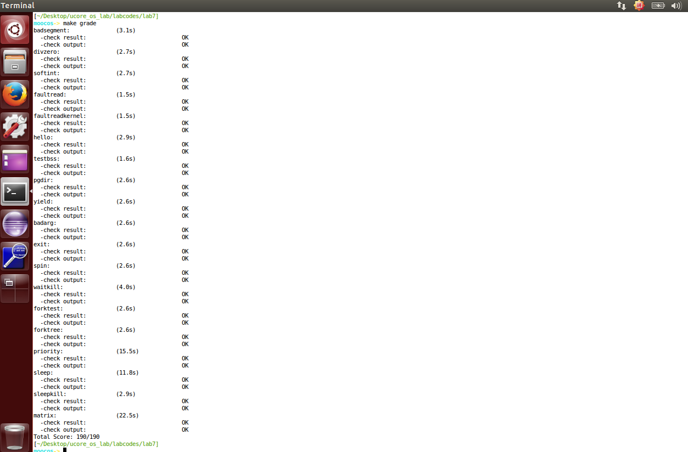

# Lab7 实验报告

2016011364 张岱墀

## 练习1：理解内核级信号量的实现和基于内核级信号量的哲学家就餐问题

答：

**设计流程**：在`kern/sync/check_sync.c`文件中实现了内核级的信号量以及基于内核级信号量的哲学家问题的解决：

1. 首先设置了哲学家就餐问题的一些常量，例如：哲学家总数，哲学家状态(`hungry`，`eating`，`thinking`)，睡眠时间以及记录哲学家状态的数组
2. 利用结构体`semaphore_t`给每个哲学家设置一个信号量
3. 利用结构体`semaphore_t`设置临界区的信号量
4. 实现了函数`phi_test_sema()`用于测试给定序号的哲学家是否能够在此时就餐，即判断其左右两边的哲学家是否处于`eating`状态
5. 实现了函数`phi_take_forks_sema()`用于让给定序号哲学家去就餐，即进入临界区 -> 调用`phi_test_sema()`判断其能否就餐 -> 退出临界区 -> 无法就餐则阻塞
6. 实现了函数`phi_put_forks_sema()`用于执行某位哲学家就餐结束之后的操作，包括：改变其状态，以及调用`phi_test_sema()`判断其相邻两个哲学家能否结束阻塞
7. 实现了函数`philosopher_using_semaphore`，在无限循环中利用上述函数判定整个哲学家就餐过程


**用户态进程/线程的信号量设计方案和异同**：

用户态进程/线程和内核态不同之处在于用户态进程/线程需要占用用户态的资源的同时，也会申请占用内核态的资源，因此在设计过程中需要同时考虑用户态资源和内核态资源的同步互斥情况。

大体框架不需要做出很大改变，需要增加信号量机制对于用户态和对于内核态两部分的情况，进行同步互斥的考虑。


## 练习2：完成内核级条件变量和基于内核级条件变量的哲学家就餐问题

答：

**算法设计过程**：

1. 完善`kern/sync/check_sync.c`文件中的`phi_take_forks_condvar()`函数，包括操作：

   * 设置指定哲学家状态为`hungry`
   * 调用`phi_test_condvar()`函数来使该名哲学家试图拿到餐具
   * 若没有拿到餐具，则调用`cond_wait()`函数使该哲学家进入该条件变量下的等待队列

   ```
   // LAB7 EXERCISE1: 2016011364
   // I am hungry
   // try to get fork
   state_condvar[i] = HUNGRY;
   phi_test_condvar(i);
   // dont get CK
   if (state_condvar[i] != EATING) {
   	cprintf("phi_take_forks_condvar: %d is waiting (cond_wait)\n",i);
   	cond_wait(&mtp->cv[i]);
   }
   ```

2. 完善`kern/sync/check_sync.c`文件中的`phi_put_forks_condvar()`函数，包括操作：

   * 指定哲学家就餐完毕后设置该哲学家状态为`thinking`
   * 调用`phi_test_condvar()`函数来测试该哲学家左右两侧的哲学家，试图解决其阻塞问题

   ```
   // LAB7 EXERCISE1: 2016011364
   // I ate over
   // test left and right neighbors
   state_condvar[i] = THINKING;
   phi_test_condvar(LEFT);
   phi_test_condvar(RIGHT);
   ```

3. 完善`kern/sync/monitor.c`文件中的`cond_signal()`函数，该函数的主要作用为：使特定的条件变量中特定等待线程的阻塞状态解除

   ```
   if(cvp -> count>0) {
       cvp -> owner -> next_count ++;
       // 条件变量对应的信号量V()
       up(&(cvp -> sem));
       // 唤醒该条件变量的等待队列中的下一个进程
       down(&(cvp -> owner -> next));
       cvp -> owner -> next_count--;
   }
   ```

4. 完善`kern/sync/monitor.c`文件中的`cond_wait()`函数，该函数的主要作用为：使特定线程进入特定条件变量的等待队列中

   ```
   cvp -> count ++;
   // P()操作：释放信号量对应资源
   if(cvp -> owner -> next_count > 0) {
   	up(&(cvp->owner->next));
   }
   else {
   	up(&(cvp->owner->mutex));
   }
   down(&(cvp -> sem));
   cvp -> count --;
   ```

5. 修改`kern/trap/trap.c`文件中的计时器**tick**相关部分：

   ```
   /* LAB7 2016011364 */
   /* you should upate you lab6 code
   * IMPORTANT FUNCTIONS:
   * run_timer_list
   */
   ticks ++;
   assert(current != NULL);
   run_timer_list();
   break;
   ```


**用户态进程/线程的条件变量机制设计方案和比较异同**：

用户态进程/线程和内核态不同之处在于用户态进程/线程需要占用用户态的资源的同时，也会申请占用内核态的资源，因此在设计过程中需要同时考虑用户态资源和内核态资源的同步互斥情况。

大体框架不需要做出很大改变，需要增加相应的条件变量机制对于用户态和对于内核态两部分的情况，进行同步互斥的考虑。

**能否不用基于信号量机制来实现条件变量**：不能：因为一定需要一个信号量标示来判断程序的临界区。


## 实验完成后相关截图




## 与ucore_lab中的参考答案进行对比

#### 练习一：理解内核级信号量的实现和基于内核级信号量的哲学家就餐问题

>`labcodes_answer/`中并未给出该题的答案

#### 练习二：完成内核级条件变量和基于内核级条件变量的哲学家就餐问题

>和答案中给出的结果的函数调用等近乎相同，实现过程中的细节顺序存在小差异


## 列出本实验个人觉得重要的知识点以及与课程对应内容的对应

* 同步互斥的概念以及由此现象会导致的问题，对应本次实验的练习一和练习二
* 同步互斥的解决方法，诸如：信号量机制，条件变量机制等，对应本次实验的练习一和练习二


## 列出觉得OS原理中很重要的但是该实验中未被涉及的知识点

- 觉得很多关于同步互斥的基础算法也很重要，例如`Peterson`，`Dekkers`算法等，本次实验中并未涉及
- 本次实验中涉及了很多关于哲学家就餐问题的内容，但是关于另一类经典问题：**读者--写者问题**并未有太多涉及